`                         `**Teams Bot to call Zebra AI Solution**

`                                                                                     `**---Amy Peng**

**1.Prerequisite:**
Ensure that you install the following tools and set up your development environment:

||
| :- |

|** |**Install**|**For using...**|
| :- | :- | :- |
| |[Microsoft 365 developer account](https://learn.microsoft.com/en-us/microsoftteams/platform/concepts/build-and-test/prepare-your-o365-tenant)|Access to Teams account with the appropriate permissions to install an app.|
| |[Visual Studio 2022](https://visualstudio.microsoft.com/)|You can install the enterprise version in Visual Studio 2022, and install the ASP.NET  and web development workloads. Use the latest version.|
| |[.NET Core SDK](https://dotnet.microsoft.com/en-us/download)|
Customized bindings for local debugging and Azure Functions app deployments. 

If you haven't installed the latest version, install the portable version.
|
| |[Microsoft Teams](https://www.microsoft.com/microsoft-teams/download-app)|Microsoft Teams to collaborate with everyone you work with through apps for chat,  meetings, and call all in one place|
| |Dev tunnel|
A tunnel connects your development system to Teams. Dev tunnel is available in  Visual Studio 2022 version 17.7.0 or later. or You can also use [ngrok](https://ngrok.com/download) as a tunnel to connect your development system to Teams. 

|

||
| :- |

**2.Register Microsoft Entra app**

1) **Go to [Azure portal](https://ms.portal.azure.com/).**
1) **Select App registrations.**

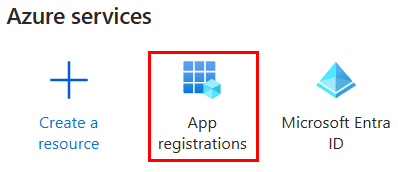

1) **Select + New registration.**

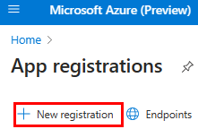

1) **Enter the name of your app.**
1) **Select Accounts in any organizational directory (Any Microsoft Entra ID tenant - Multitenant).**
1) **Select Register.**

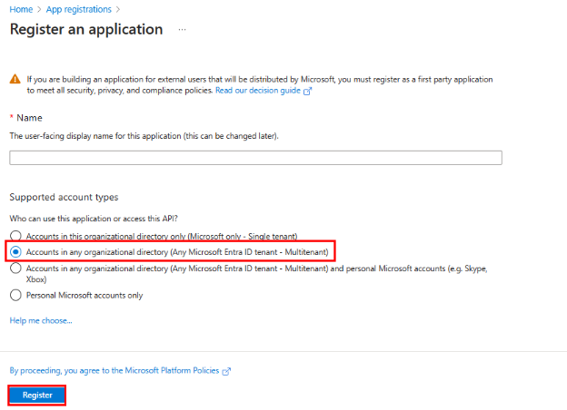

**Your app is registered in Microsoft Entra ID. The app overview page appears.**

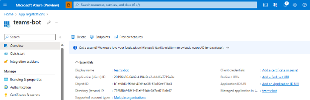

1) **Bind Service Management ID (If you want to use to get the application based permission)**

   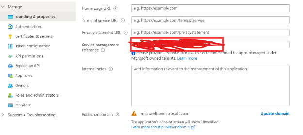

1) **Get Zebra AI Application Permission (If you want to use to get the application based permission)**

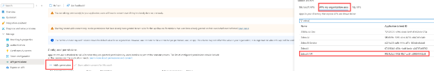

`     `**Note: You can skip the step 7 and step 8, if you only want to get the user based permission, which means that you can not share your teams bot to others if they are not the owner for your zebra AI experiments. But if you have done the step 7 and step 8 which means that everyone who is using your teams bot can use your zebra AI experiments.** 

**9) Go to [this Zebra AI form](https://forms.office.com/pages/responsepage.aspx?id=v4j5cvGGr0GRqy180BHbR3IuNv7lfiNCnaFIzX4ZZoFUQ0NGMUxFT1owVzM0MEtaWlVPWVRGOEs2Ni4u&route=shorturl) to apply for zebra API permission by entering your client ID and experiment id.**

**3. Setup your Local Debuging Environment**

1) **Open**  [**https://github.com/AmyPengMS/MSTeamsBot](https://github.com/AmyPengMS/MSTeamsBot) **to my github app**
1) **Select Code.**
1) **From the dropdown menu, select Open with GitHub Desktop or Download Zip.**
1) **Open the application using Visual Studio**
1) **In the debug dropdown list, select Dev Tunnels (no active tunnel) > Create a Tunnel....**

   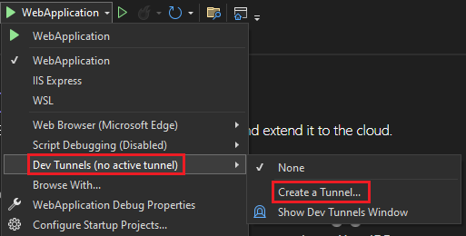

1) **Update the following details in the pop-up window:**

   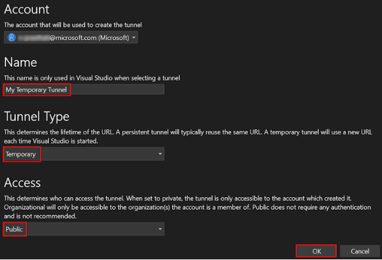

1) **A pop-up window appears showing that dev tunnel is successfully created.**

   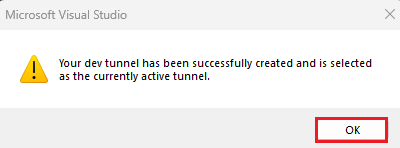

1) **You can find the tunnel you've created in the debug dropdown list as follows:**

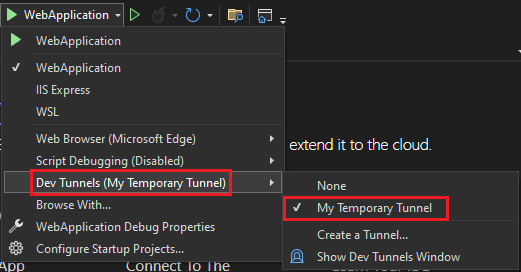

1) **Select F5 to run the application in the debug mode.**
1) **If a Security Warning dialog appears, select Yes.**

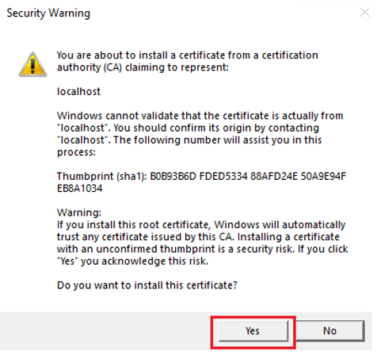

1) **A pop-up window appears.**
1) **Select Continue.**

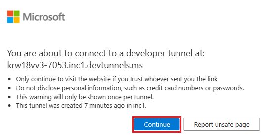

1) **The dev tunnel home page opens in a new browser window and the dev tunnel is now active.**

   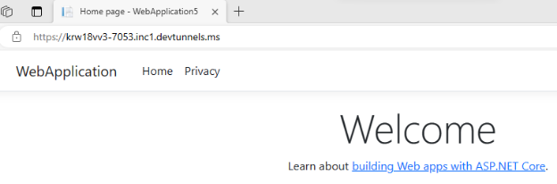

1) **Go to Visual Studio, select View > Output.**
1) **From the Output console dropdown menu, select Dev Tunnels.**
1) **The Output console shows the dev tunnel URL.**

   ![Screenshot shows the url in the Visual Studio output console.] **17) Please remember this URL**

**4. Create Azure Bot**

1) **Go to Home.**
1) **Select + Create a resource.**
1) **In the search box, enter Azure Bot.**
1) **Select Enter.**
1) **Select Azure Bot.**
1) **Select Create.**

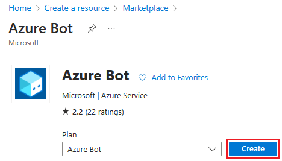

1) **Enter the bot name in Bot handle.**
1) **Select your Subscription from the dropdown list.**
1) **Select your Resource group from the dropdown list.**

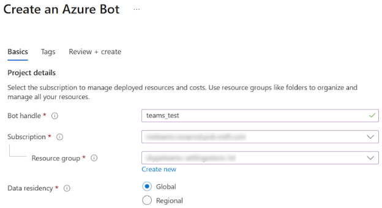

**If you don't have an existing resource group, you can create a new resource group. To create a new resource group, follow these steps:**

1. **Select Create new.**
1. **Enter the resource name and select OK.**
1. **Select a location from New resource group location dropdown list.**

   

1) **Under Pricing, select Change plan.**

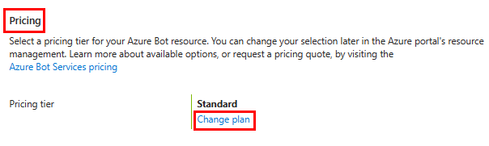

1) **Select FO Free > Select.**

1) **Under Microsoft App ID, select Type of App as Multi Tenant.**
1) **In the Creation type, select Use existing app registration.**
1) **Enter the App ID.**
1) **Select Review + create.**

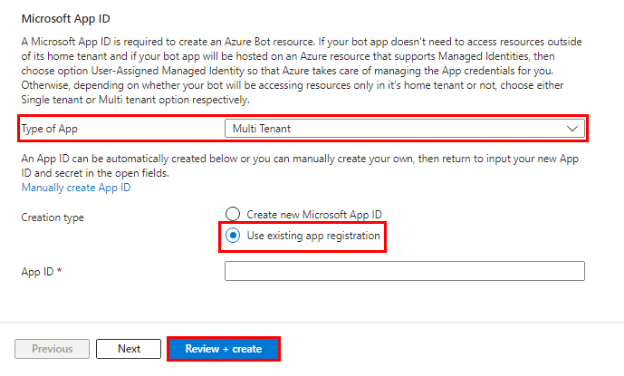

1) **After the validation passes, select Create.**

**The bot takes a few minutes to provision.**

1) **Select Go to resource.**

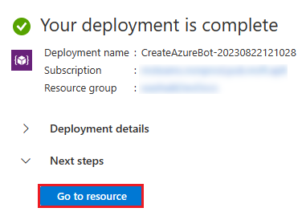

**You've successfully created your Azure bot.**

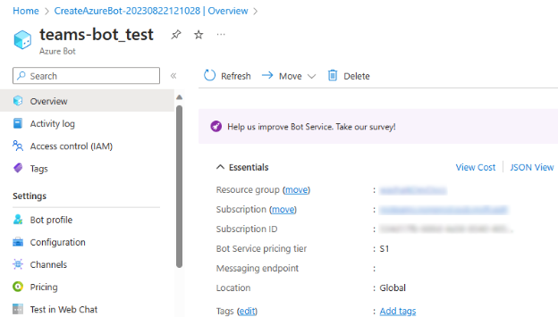

**Add a Teams channel**

1. **In the left pane, select Channels.**
1. **Under Available Channels, select Microsoft Teams.**

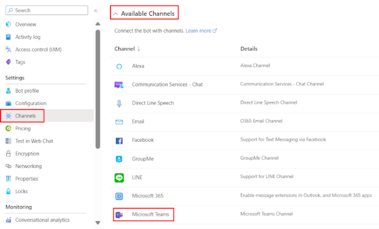

1. **Select the checkbox to accept the Terms of Service.**
1. **Select Agree.**

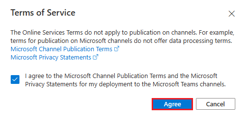

1. **Select Apply.**

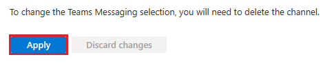

**To add a messaging endpoint**

1) **Use the dev tunnel URL in the Output console as the messaging endpoint.**

   ![Screenshot shows the url in the Visual studio output console.][Screenshot shows the url in the Visual Studio output console.]

1) **In the left pane, under Settings, select Configuration.**
1) **Update the Messaging endpoint in the format https://your-devtunnel-domain/api/messages.**

   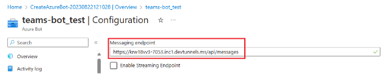

1) **Select Apply.**
1) **You've successfully set up a bot in Azure Bot service.**

**5. Update your experiment id**

1) **Go to the MessageReactionBot.cs file to find the OnMessageActivityAsync method, then change the experiment id to your own and you can also add multiple experiment ids to get zebra AI data based on your requirements**

   **Note: This application is adding the authentication method for application based permission, if you want to have the user-based permission, please change this GetAPPEntraIdToken() method by referring this method: GetInteractiveUserEntraIdToken() on [Zebra AI official sample](https://microsoftapc.sharepoint.com/:u:/t/ZebraAI/EXoe5ZAy3_dOmVo1IW6qpTUBN3R7fhZiTZ5eKZTY0Ov7Rg?e=bhLvN5).**

**6.Set up bot service connection**

**To update appsettings**

1. **Open the appsettings.json file in Visual Studio and update the configuration for the bot.**

   1. **Set "MicrosoftAppType"to Multitenant.**
   1. **Set "MicrosoftAppId" to your bot's Microsoft App ID.**
   1. **Set "MicrosoftAppPassword" to your bot's client secrets Value.**
   1. **Set your "MicrosoftAppTenantId" to your tenant ID.**

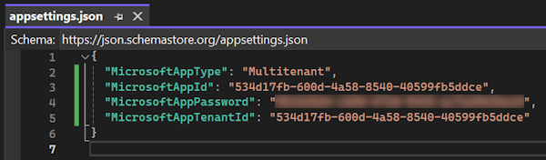

1. **Select Save.**

**To update manifest**

1. **In the File Explorer, go to Microsoft-Teams-Samples > samples > bot-conversation > csharp > TeamsApp > appPackage.**

1. **Open the manifest.json file in Visual Studio and make the following changes:**

   1. **Replace "id"and "botId" to your bot's Microsoft App ID.**
   1. **Replace validDomains to "validDomains": [
      `     `"\*.asse.devtunnels.ms",]**
1. **Zip the contents of the** appPackage **folder to create manifest.zip.**

` `**Note**

**The manifest.zip must not contain any other folders in it. It must have manifest json source file, color icon, and outline icon inside the zip folder. Run your solution in Visual Studio and upload your manifest in your demo tenant for organization or your Teams account.**

**7.Install Teams APP**

**To upload the app to Teams**

1. **In the Teams client, select the Apps icon.**
1. **Select Manage your apps.**
1. **Select Upload an app.**
1. **Look for the option to Upload a custom app. If the option is visible, custom app upload is enabled.**

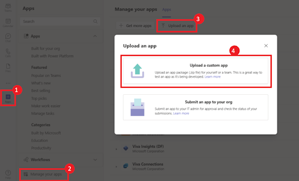

` `**Note**

**Contact your Teams administrator, if you don't find the option to upload a custom app.**

1. **Select Open to upload the .zip file that you created in the appPackage folder.**

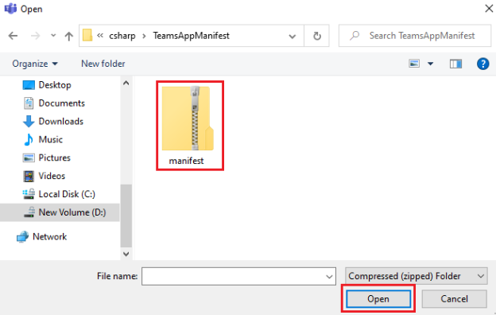

1. **Select Add.**

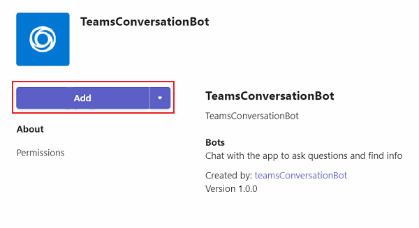

**You can interact with the bot.**

**8.Deploy Application to Azure**

**1) Right-Click your solution and click Pulish step by step to publish to Azure App Service**

**2)Please remember to change your bot messging endpoint to your azurewebsite uri**

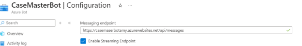

**3)Please remember to change validDomains in your manifest to your azurewebsite uri
**

**4)Zip your manifest again**

**5) Follow the step 8 to install teams app again**

**6)Now you can share your manifest to others to use your bots.**

[Screenshot shows the url in the Visual Studio output console.]: Aspose.Words.19d4e15f-f853-43bc-984f-1e0af15bf6e2.014.png
